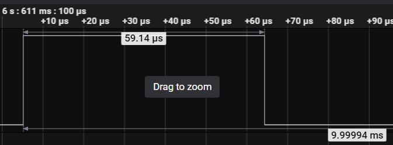
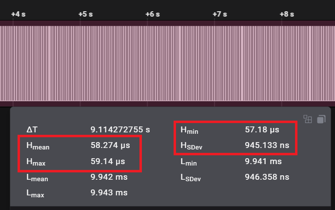

# Printf Task
Task for handling `printf` duties intended for small embedded systems

## Overview
PrintfTask is intended for embedded systems, including small micro controller environments running a lightweight RTOS (e.g. FreeRTOS). The PrintfTask offloads the majority of `printf` duties to a low priority thread that can run in the background. This provides more deterministic behavior when using `printf` in all other tasks in the system. It also provides for less timing impacts that `printf` can add to timing critical tasks.

## Introduction
Printf is a staple when debugging code and systems of all sizes. Often on small embedded targets, `printf` is routed to a UART so the user can see various output on a local terminal on their PC, or other device. Not only for debugging, but also used as an output mechanism for users, CLI (command line interface), stats, periodic info, and many other uses.  By moving the timing intensive portions to a separate task, the system can behave more deterministicly, while also providing desired output from the user without the worry of where and when to place `printf` statements.  It also removes the need for the user to create some custom type of print output mechanism to overcome the possible timing issues.

## Background
Nearly every product I've worked on has included some type of `printf` or output mechanism to a UART. This is not only useful, it's essential in many embedded projects and systems. A significant problem can arise when trying to use `printf` for info, stats, or debugging of timing critical tasks. `printf` routed to a UART can be an expensive time operation. It can also cause different system and software behavior because of the timing impacts. Countless times I've seen a system "work" when the `printf` statements were included, but not when they were removed... and vice versa. This makes debugging more challenging in such instances. While it can be an indication of a poor design, it's often useful to have a `printf` ability with minimal disturbance to the system timing.  This solution proposes one such implementation to minimize timing issues for `printf`.

## Features
- Use normal `printf` (No need to write a custom `printf` implementation, or replace all `printf` statements already being used)
- Utilizes circular buffer that can be any size desired by the user
- Dedicated `printf` task handles output operations (e.g. UART output)
- Significantly reduces time for `printf` calls
- Provides more deterministic behaviour for all `printf` calls
- Minimizes timing impacts to timing critical tasks

## Using the Code
For usage throughout the code, just use `printf` as you normally would. Once setup and configured, `printf` can be added anywhere without any special considerations.

### Printf Task
The `PrintfTask` functionality relies on the operating system in use and is required to have its own task/thread to operate in. Therefore, the developer needs to create and start the `PrintfTask` as part of the rest of the system task initializations. For example, in FreeRTOS:

```
void StartPrintfTask(void *argument)
{
    PrintfTask task;
    task.Initialize();
    task.Run();
}

void app_main(void)
{
    TaskHandle_t taskHandle = nullptr;

    // Printf task
    xTaskCreate(&StartPrintfTask, "PrintfTask", PRINTF_TASK_STACK_SIZE, NULL, PRINTF_TASK_PRIORITY, &taskHandle);

    // Other initialization
    // ...
}
```

### OS Porting
The `PrintfTask` also uses some of the operating system calls to operate. Therefore, *TargetPort.hpp* and *TargetPort.cpp* were created to easily port for different operating systems being utilized. The main items for porting purposes are message queue operations, task identification operations and watchdog operations.

### Target Porting
This code was developed on an ESP32. However, this can be adapted to use with any target and RTOS. To effectively redirect `printf` to this implementation of `stdout`, we must configure `stdout` as part of the initialization process. For the ESP32, this is done as below, in *PrintfUtils.c*:

```
// function pointer that's used to flush the buffer when writing out from task
int (*realStdOutWrite)(struct _reent *, void *, const char *, int);

void InitStdOut()
{
    // This will change based on the target being used. This is how to do it
    // on an ESP32 target
    realStdOutWrite = _GLOBAL_REENT->_stdout->_write;
    _GLOBAL_REENT->_stdout->_write = WriteReroute;
}
```

The original `_write` function pointer must be saved because that will be used to output the data when the `PrintfTask` runs. How `stdout` works and is assigned will vary by target, so the user will need to research how to do this based on the desired target. For example, on an STM32, using the STM32IDE and compiler, you simply need to override the following functions:

```
int __io_putchar(int ch);
int _write(int fd, char *ptr, int len);
```

## Analysis
Based on the ESP32 target, we can inspect and do measurements to see the improvements made for this implementation.  Let's start by looking
at a simple single line example:

```
void Task1::HandleProcess()
{
    static uint32_t count = 0;

    count++;

    gpio_set_level(GPIO_OUTPUT_IO_0, 1);
    printf("Task1 stuff: %u\r\n", count);
    gpio_set_level(GPIO_OUTPUT_IO_0, 0);

    DELAY_MS(10);
    Process();
}
```

The above simply writes a single `printf` output statement and delays 10 ms. This is repeated forever.  The GPIO setting allows us to independently measure the results, with and without, the `PrintfTask` and `printf` redirects.

With normal `printf` implementation, we see the following results:





The following sequence diagram shows how this process operates.


## Conclusions
The included code provides more thorough examples and details.


