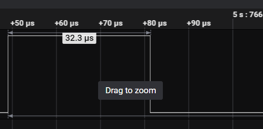
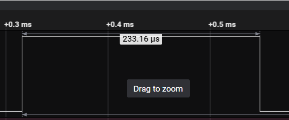
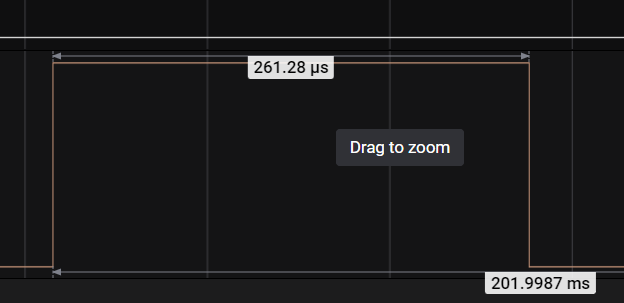

# Printf Task
Task for handling `printf` duties intended for small embedded systems

## Overview
`PrintfTask` is intended for embedded systems, including small micro controller environments running a lightweight RTOS (e.g. FreeRTOS). The PrintfTask offloads the majority of `printf` duties to a low priority thread that can run in the background. This provides more deterministic behavior when using `printf` in all other tasks in the system. It also provides for less timing impacts that `printf` can add to timing critical tasks.

## Introduction
`printf` is a staple when debugging code and systems of all sizes. Often on small embedded targets, `printf` is routed to a UART so the developer can see various output on a local terminal on their PC, or other device. Not only for debugging, but also used as an output mechanism for users, CLI (command line interface), stats, periodic info, and many other uses.  By moving the timing intensive portions to a separate task, the system can behave more deterministically, while also providing desired output to the user without the worry of where and when to place `printf` statements.  It also removes the need for the developer to create some custom type of print output mechanism to overcome the possible timing issues.

## Background
Nearly every product I've worked on has included some type of `printf` or output mechanism to a UART. This is not only useful, it's essential in many embedded projects and systems. A significant problem can arise when trying to use `printf` for info, stats, or debugging of timing critical tasks. `printf` routed to a UART can be an expensive time operation. It can also cause different system and software behavior because of the timing impacts. Countless times I've seen a system "work" when the `printf` statements were included, but not when they were removed... and vice versa. This makes debugging more challenging in such instances. While it can be an indication of a poor design, it's often useful to have a `printf` ability with minimal disturbance to the system timing.  This solution proposes one such implementation to minimize timing issues for `printf`.

## Features
- Use normal `printf` (No need to write a custom `printf` implementation, or replace all `printf` statements already being used)
- Utilizes circular buffer that can be any size desired by the developer
- Dedicated `printf` task handles output operations (e.g. UART output)
- Significantly reduces time for `printf` calls
- Provides more deterministic behaviour for all `printf` calls
- Minimizes timing impacts to timing critical tasks

## Using the Code
For usage throughout the code, just use `printf` as you normally would. Once setup and configured, `printf` can be added anywhere without any special considerations.

### Printf Task
The `PrintfTask` functionality relies on the operating system in use and is required to have its own task/thread to operate in. Therefore, the developer needs to create and start the `PrintfTask` as part of the rest of the system task initializations. For example, in FreeRTOS:

```
void StartPrintfTask(void *argument)
{
    PrintfTask task;
    task.Initialize();
    task.Run();
}

void app_main(void)
{
    TaskHandle_t taskHandle = nullptr;

    // Printf task
    xTaskCreate(&StartPrintfTask, "PrintfTask", PRINTF_TASK_STACK_SIZE, NULL, PRINTF_TASK_PRIORITY, &taskHandle);

    // Other initialization
    // ...
}
```

### OS Porting
The `PrintfTask` also uses some of the operating system calls to operate. Therefore, *TargetPort.hpp* and *TargetPort.cpp* were created to easily port for different operating systems being utilized. The main items for porting purposes are message queue operations.

### Target Porting
This code was developed on an ESP32. However, this can be adapted to use with any target and RTOS. To effectively redirect `printf` to this implementation of `stdout`, we must configure `stdout` as part of the initialization process. For the ESP32, this is done as below, in *PrintfUtils.c*:

```
// function pointer that's used to flush the buffer when writing out from task
int (*realStdOutWrite)(struct _reent *, void *, const char *, int);

void InitStdOut()
{
    // This will change based on the target being used. This is how to do it on an ESP32 target
    realStdOutWrite = _GLOBAL_REENT->_stdout->_write;
    _GLOBAL_REENT->_stdout->_write = WriteReroute;
}
```

The original `_write` function pointer must be saved because that will be used to output the data when the `PrintfTask` runs. How `stdout` works and is assigned will vary by target, so the developer will need to research how to do this based on the desired target. For example, on an STM32, using the STM32IDE and compiler, you simply need to override the following functions:

```
int __io_putchar(int ch);
int _write(int fd, char *ptr, int len);
```

### Multithreaded Protection
The ESP32 provides thread protection through layers between the printf call and the stdout redirect natively. Therefore, the code provided doesn't use locks/mutexs for the `WriteReroute` function in *PrintUtils.c*. If the target does **not** support thread protection natively, then a lock or mutex should be used to wrap the operations in `WriteReroute`. This will keep the `printf` statements, from multiple tasks, from interspersing or corrupting the stdout buffer.

## Analysis
Based on the ESP32 target, we can inspect and do measurements to see the improvements made for this implementation.  

### Example 1
Let's start by looking at a simple single line example:

```
void Task1::HandleProcess()
{
    static uint32_t count = 0;

    count++;

    gpio_set_level(GPIO_OUTPUT_IO_0, 1);
    printf("Task1 stuff: %u\r\n", count);
    gpio_set_level(GPIO_OUTPUT_IO_0, 0);

    DELAY_MS(10);
    Process();
}
```

The above simply writes a single `printf` output statement and delays 10 ms. This is repeated forever.  The GPIO setting allows us to independently measure the results, with and without, the `PrintfTask` and `printf` redirects.

With normal `printf` implementation, we see the following results:


And with `PrintfTask` implementation:




The above shows ~44% improvement, but going from 52 microseconds to 32 microseconds may not have a significant timing impact on your system. This result is because the UART buffer is larger than the data we are trying to write in this single statement. Therefore, the UART is able to hold all the data while it pushed it out the communication bus, while
letting the CPU continue on to further operations.

### Example 2
Let's look at a more complex example with multiple `printf` statements:

```
void Task2::HandleProcess()
{
    vTaskList(taskListBuf);
    gpio_set_level(GPIO_OUTPUT_IO_0, 1);
    printf("\r\nTASK INFO**********************************************\r\n");
    printf("Name          State  Priority   Stack   Num    Core\r\n");
    printf("*******************************************************\r\n");
    printf("%s\r\n", taskListBuf);
    printf("\r\n");
    gpio_set_level(GPIO_OUTPUT_IO_0, 0);

    vTaskGetRunTimeStats(taskStatsBuf);
    gpio_set_level(GPIO_OUTPUT_IO_1, 1);
    printf("TASK STATS INFO****************************************\r\n");
    printf("Name             Abs Time       %% Time\r\n");
    printf("*******************************************\r\n");
    printf("%s\r\n", taskStatsBuf);
    printf("\r\n");

    printf("High Water Mark: %d\r\n", GetHighWaterMark());
    printf("\r\n");
    gpio_set_level(GPIO_OUTPUT_IO_1, 0);
}
```

The above writes multiple `printf` output statements and delays 100 ms. This is repeated forever. There are two separate sections based on getting task list and task stats. The GPIO setting allows us to independently measure the results, with and without, the `PrintfTask` and `printf` redirects.

With normal `printf` implementation, we see the following results:

Task List:


Task Stats:


And with `PrintfTask` implementation:

Task List:




Task Stats:




Now we can see a significant improvement using the `PrintfTask` implementation. This is over a 10x improvement and may have a large timing impact for timing critical tasks. The UART buffer can not hold all of the data that the multiple `printf` statements are producing quickly. As such, the `printf` statements for the normal `printf` implementation must wait for the UART to transmit much of the data before allowing the CPU to continue to the next operations. The `PrintfTask` can store all the data in the buffer quickly and then output the data when the `PrintfTask` is allowed to execute.

## Alternative Implementations
There are alternative implementations that can accomplish similar results. Each has it's own advantages and disadvantages. I will briefly review a few of these alternatives.

### Overriding `printf`
Instead of redirecting, overriding `printf` could be another tactic. With a custom `printf`, you could do something like just reroute to a buffer using `vsprintf` and then printing that buffer out later. This is similar to what the code here does, but at a higher level. The problem with this approach is properly overriding `printf`, if even possible, and also remembering to `#include` the correct file for this approach. There's more opportunity for human error and making mistakes.

### Creating Custom Print function
It's possible to also just create a custom function, let's call it `MyPrintf`. This can also use `vsprintf`, or some other buffer writing mechanism. We run into similar issues as above though. Every file using this needs to `#include` the proper file. This is less likely to be have conflicts or mistakes because the name is different. However, if you're adding this to an existing system, you may have to replace ALL `printf` statements in your code. That may be unreasonable or not possible in many projects.

### UART interrupts
If `stdout` is routed to the UART through a UART driver, specifically a custom driver, the UART driver could hold the buffer. In this implementation, the UART generates an interrupt when it can receive more data. The ISR can move one, or more bytes, from the driver buffer into the UART hardware buffer. This allows the tasks to keep executing while offloading the communication transmission. The negatives with this approach are added interrupts in the system (which could cause less deterministic behavior) and this is specific to UART usage only. It's also only available if the UART driver can be customized and used for routing `stdout`.

## Conclusions
The included code demonstrates a small improvement in performance, in the worst case, and a **large** improvement in best case usage scenarios. The developer should evaluate if this is appropriate, or even one of the alternative approaches, to improve deterministic behavior in the intended system. This change has the potential to allow `printf` in all tasks without concern for timing impacts, while providing more useful output for the developer and/or user.


